<!--
  ════════════════════════════════════════════════════════════════════
  CODEX00911 — GitHub Profile README

  Design system:
    background  #0D1117    surface     #161B22
    border      #30363D    primary     #58A6FF
    accent      #7C3AED    glow        #00E5FF
    text        #F0F6FC    muted       #8B949E

  ✏️  TODO — replace the last contact placeholder below:
     · Discord invite  ->  YOUR_DISCORD_INVITE
  ════════════════════════════════════════════════════════════════════
-->

<div align="center">
  
</div>

<br/>

<div align="center">
  
</div>

<div align="center">
  <a href="https://github.com/Codex00911">
    
  </a>
  <a href="https://discord.gg/YOUR_DISCORD_INVITE">
    
  </a>
  <a href="mailto:codex@codex00.qzz.io">
    
  </a>
</div>

<div align="center">
  <code>4 public repositories</code> · <code>Java-first</code> · <code>PaperMC</code> · <code>Open Source</code>
</div>

<br/>

<div align="center">
  
</div>

## <div align="center">👋 About Me</div>

Instead of paragraphs, let the code speak:

```java
public final class Codex {

    private final String role     = "Software Engineer";
    private final String focus    = "Minecraft Infrastructure & Scalable Backends";
    private final String stack    = "Java · Rust · Python · JS/TS";
    private final String location = "India";
    private final String learning = "Distributed Systems & Cloud Infrastructure";

    // The build never really stops.
    public void build() {
        while (isNight()) {
            commit(qualityOverQuantity()); // always ship the good stuff
        }
    }
}
```

<div align="center">
  
</div>

## <div align="center">🚀 What I Build</div>

<table>
  <tr>
    <td align="center">
      <b>🟩 Minecraft Plugins</b>
      <br/><br/>
      <code>Paper</code> · <code>Spigot</code> · <code>Adventure API</code>
      <br/>
      <code>PlaceholderAPI</code> · <code>Custom Mechanics</code>
    </td>
    <td align="center">
      <b>🌐 Web Development</b>
      <br/><br/>
      <code>Modern UI</code> · <code>Dashboards</code> · <code>REST APIs</code>
      <br/>
      <code>Auth</code> · <code>Responsive Design</code>
    </td>
    <td align="center">
      <b>🤖 Discord Bots</b>
      <br/><br/>
      <code>Slash Commands</code> · <code>Moderation</code> · <code>Tickets</code>
      <br/>
      <code>Logging</code> · <code>Verification</code>
    </td>
  </tr>
  <tr>
    <td align="center">
      <b>⚙️ Backend</b>
      <br/><br/>
      <code>Java</code> · <code>Rust</code> · <code>Python</code>
      <br/>
      <code>PostgreSQL</code> · <code>Docker</code> · <code>Redis</code>
    </td>
    <td align="center">
      <b>🔄 Automation</b>
      <br/><br/>
      <code>n8n</code> · <code>Webhooks</code> · <code>Scheduled Backups</code>
      <br/>
      <code>Monitoring</code> · <code>Server Automation</code>
    </td>
    <td align="center">
      <b>☁️ Infrastructure</b>
      <br/><br/>
      <code>Linux</code> · <code>NGINX</code> · <code>PM2</code>
      <br/>
      <code>GitHub Actions</code> · <code>Cloudflare</code>
    </td>
  </tr>
</table>

<div align="center">
  
</div>

## <div align="center">🧰 Tech Stack</div>

<table>
  <tr>
    <td align="center">
      <b>🎮 Minecraft</b>
      <br/><br/>
      <code>Paper API</code> · <code>Spigot</code>
      <br/>
      <code>Adventure API</code> · <code>LuckPerms API</code>
    </td>
    <td align="center">
      <b>💻 Languages</b>
      <br/><br/>
      <code>Java</code> · <code>Rust</code> · <code>Python</code>
      <br/>
      <code>JavaScript</code> · <code>SQL</code>
    </td>
    <td align="center">
      <b>🗄️ Backend</b>
      <br/><br/>
      <code>Spring</code> · <code>Node.js</code> · <code>Express</code>
      <br/>
      <code>PostgreSQL</code> · <code>Redis</code> · <code>Docker</code>
    </td>
  </tr>
  <tr>
    <td align="center">
      <b>🛠️ DevOps</b>
      <br/><br/>
      <code>GitHub Actions</code> · <code>Linux</code>
      <br/>
      <code>Gradle</code> · <code>Maven</code> · <code>Cloudflare</code>
    </td>
    <td align="center">
      <b>⚡ Automation</b>
      <br/><br/>
      <code>n8n</code> · <code>Discord Webhooks</code>
      <br/>
      <code>REST APIs</code> · <code>Cron Jobs</code>
    </td>
  </tr>
</table>

<div align="center">
  
</div>

## <div align="center">🌟 Featured Open Source</div>

<table>
  <tr>
    <td align="center">
      <a href="https://github.com/Codex00911/LevelGate"><b>🚀 LevelGate</b> ⭐ flagship</a>
      <br/><br/>
      
      
      
      <br/><br/>
      A production-ready Paper plugin: players unlock commands by leveling up
      through <b>playtime, mob kills, mining, crafting &amp; voting</b>.
      <br/><br/>
      <code>Level Progression</code> · <code>Command Unlocks</code> · <code>GUI</code> ·
      <code>Discord Webhooks</code> · <code>PlaceholderAPI</code> · <code>Adventure Components</code>
    </td>
    <td align="center">
      <a href="https://github.com/Codex00911/Graphify-Pro"><b>📊 Graphify-Pro</b></a>
      <br/><br/>
      
      
      <br/><br/>
      High-performance data visualization toolkit, written in Rust.
      <br/><br/>
      <code>Rust</code> · <code>Performance</code> · <code>Data Viz</code>
    </td>
    <td align="center">
      <a href="https://github.com/Codex00911/telegram-secretary-bot"><b>📨 telegram-secretary-bot</b></a>
      <br/><br/>
      
      <br/><br/>
      A Telegram assistant bot for automating the day-to-day.
      <br/><br/>
      <code>Python</code> · <code>Telegram API</code> · <code>Automation</code>
    </td>
  </tr>
</table>

<div align="center">
  
</div>

## <div align="center">🔒 Behind the Scenes</div>

Private infrastructure powering production systems. No fake links — just work in progress.

<table>
  <tr>
    <td align="center">
      <b>⛏️ MineDrop Network</b>
      <br/><br/>
      Private Minecraft network infrastructure.
      <br/>
      <code>Core Systems</code> · <code>Custom Plugins</code> · <code>Discord</code>
    </td>
    <td align="center">
      <b>🧱 MDN-Core</b>
      <br/><br/>
      Core platform powering MineDrop.
      <br/>
      <code>Java</code> · <code>Performance</code> · <code>Modular</code>
    </td>
    <td align="center">
      <b>📊 MineDrop Dashboard</b>
      <br/><br/>
      Internal management platform.
      <br/>
      <code>Web</code> · <code>Analytics</code> · <code>Realtime</code>
    </td>
    <td align="center">
      <b>⚙️ Automation Platform</b>
      <br/><br/>
      Production n8n workflows.
      <br/>
      <code>n8n</code> · <code>Webhooks</code> · <code>Monitoring</code>
    </td>
  </tr>
</table>

<div align="center">
  
</div>

## <div align="center">📈 GitHub Analytics</div>

<!--
  Widgets are served by third-party services (github-readme-stats, streak-stats,
  activity-graph). If the classic github-readme-stats endpoint ever goes down,
  swap in the maintained fork: https://github.com/cihat/forked-github-readme-stats
  (same query parameters).
-->

<div align="center">
  
  
  <br/><br/>
  
  <br/><br/>
  
</div>

<div align="center">
  
</div>

## <div align="center">🎯 Current Focus</div>

| Focus | Status |
| :--- | :--- |
| 🚀 **LevelGate** — production Paper plugin | ✅ shipped |
| ✨ **Lumina** — custom content engine | 🔨 in development |
| ⛏️ **MineDrop Network** — private infrastructure | 🔒 private |
| ⚙️ **n8n automation** — production workflows | 🔄 evolving |
| 📚 **Learning** — distributed systems & cloud | 🌱 always |

## <div align="center">💡 Philosophy</div>

> Great software isn't built by chasing complexity. It's built by solving problems with clarity, performance, and maintainability.

<div align="center">
  
</div>

## <div align="center">🐍 Contribution</div>

<div align="center">
  <!-- The snake appears after the "Generate Contribution Snake" action runs
       once (manual run: Actions → Generate Contribution Snake → Run workflow). -->
  
</div>

<br/>

<div align="center">
  
</div>

<div align="center">
  <b>Thanks for stopping by.</b>
  <br/>
  Let's build something amazing. ❤️
  <br/><br/>
  
</div>
